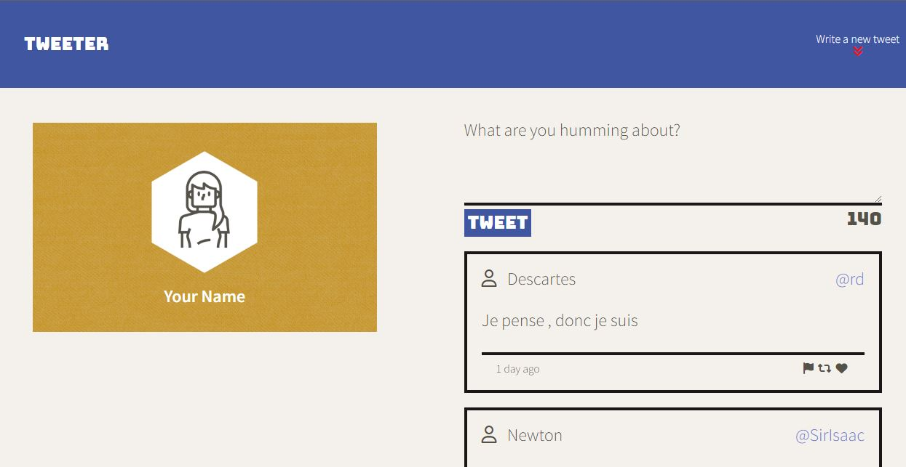
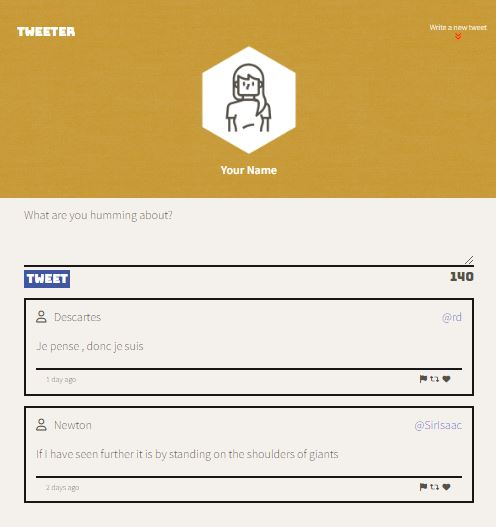

# Tweeter Project

Tweeter is a simple, single-page Twitter clone.

The page features HTML, CSS, JS, jQuery and AJAX front-end skills, and Node, Express back-end skills. This page also changes dynamically to display a friendly user experience for different devices and is also protected against XSS malware (typing javascript into the forms won't affect the web page) 

## Getting Started

1. Clone this repository onto your local device.
2. Install dependencies using the `npm install` command.
3. Start the web server using the `npm run local` command. The app will be served at <http://localhost:8080/>.
4. Go to <http://localhost:8080/> in your browser and check out the features of this web page.

## Final Product

## Dependencies

- Express 4.18.2 or above
- Node 5.10.x or above
- body-parser 1.15.2 or above
- chance 1.0.2 or above
- md5 2.1.0 or above
